# 🎓 Student Performance Predictor AI

> **A Production-Grade End-to-End Machine Learning System for Educational Analytics.**

<div align="center">

[](https://www.python.org/)
[](https://fastapi.tiangolo.com/)
[](https://nextjs.org/)
[](https://www.docker.com/)
[](https://scikit-learn.org/)
[](https://opensource.org/licenses/MIT)
[](http://makeapullrequest.com)

[View Demo](https://student-performance-predictor-ai.vercel.app/) · [Report Bug](https://github.com/anish-devgit/student-performance-predictor-ai/issues) · [Request Feature](https://github.com/anish-devgit/student-performance-predictor-ai/issues)

</div>

---

## 📖 About The Project

**Student Performance Predictor AI** is not just another data science script—it's a **full-stack, production-ready AI application** engineered to provide actionable insights into student performance.

Built to bridge the gap between heavy machine learning models and intuitive user interfaces, this system processes over **20,000+ student records** to identify the key drivers of academic success. Whether you are an educator, a student, or a developer, this platform offers a robust environment to explore educational data.

### 🎯 Key Features

- **🧠 Advanced Predictive Engine**: Powered by a finely-tuned Linear Regression model achieving **73% R² Accuracy**.
- **⚡ High-Performance API**: Built with **FastAPI** for sub-millisecond inference latency.
- **🎨 Modern Dashboard**: A stunning, responsive Dark Mode UI crafted with **Next.js 14** and **Tailwind CSS**.
- **🔍 Explainable AI (XAI)**: Understand *why* a prediction was made with detailed feature contribution breakdowns.
- **🐳 Containerized & Portable**: Fully Dockerized for "write once, run anywhere" deployment.

---

## 🏗️ Architecture

The system follows a modern microservices architecture:

```mermaid
graph TD
    User[👤 User] -->|HTTPS| Client[💻 Next.js Frontend]
    Client -->|JSON| API[⚡ FastAPI Backend]
    API -->|Inference| Model["🧠 ML Model (Scikit-Learn)"]
    API -->|Process| Pipeline[⚙️ Data Pipeline]
    Pipeline -->|Train/Test| Data[(📊 Student Data)]
```



---

## 🛠️ Tech Stack

### **Machine Learning & Data Science**
- **Python 3.10**: Core language.
- **Scikit-Learn**: Model training and evaluation.
- **Pandas & NumPy**: High-performance data manipulation.
- **Joblib**: Model serialization.

### **Backend**
- **FastAPI**: Asynchronous web framework.
- **Uvicorn**: ASGI server.
- **Pydantic**: Data validation and settings management.

### **Frontend**
- **Next.js 14**: React framework for production.
- **Recharts**: Composable charting library.
- **CSS Modules**: Scoped styling.

### **DevOps**
- **Docker**: Containerization.
- **Docker Compose**: Multi-container orchestration.

---

## 🚀 Getting Started

### Prerequisites
- **Git**
- **Docker Desktop** (Recommended)
- **Node.js 18+** & **Python 3.10+** (For manual setup)

### 🐳 Application Setup (Recommended)

The easiest way to run the entire stack is via Docker.

1. **Clone the repository**
   ```bash
   git clone https://github.com/anish-devgit/student-performance-predictor-ai.git
   cd student-performance-predictor-ai
   ```

2. **Start the application**
   ```bash
   docker-compose up --build
   ```

3. **Access the Application**
   - **Frontend Dashboard:** [http://localhost:3000](http://localhost:3000)
   - **Backend API Documentation:** [http://localhost:8000/docs](http://localhost:8000/docs)

### 💻 Manual Setup

<details>
<summary>Click to verify manual installation steps</summary>

#### Backend
```bash
cd app/backend
pip install -r ../../requirements.txt
uvicorn main:app --reload
```

#### Frontend
```bash
cd app/frontend
npm install
npm run dev
```
</details>

---

## 🛣️ Roadmap

- [x] Initial ML Model Training & Evaluation
- [x] FastAPI Backend Implementation
- [x] Next.js Frontend Dashboard
- [ ] **Advanced Models**: Integrate Random Forest & XGBoost for higher accuracy.
- [ ] **User Auth**: Add authentication for personalized student tracking.
- [ ] **PDF Reports**: Auto-generate performance analysis reports.
- [ ] **Mobile App**: React Native mobile counterpart.

See the [open issues](https://github.com/anish-devgit/student-performance-predictor-ai/issues) for a full list of proposed features (and known issues).

---

## 🤝 Contributing

Contributions are what make the open source community such an amazing place to learn, inspire, and create. Any contributions you make are **greatly appreciated**.

Please view our [**Contributing Guidelines**](CONTRIBUTING.md) for more details.

1. Fork the Project
2. Create your Feature Branch (`git checkout -b feature/AmazingFeature`)
3. Commit your Changes (`git commit -m 'Add some AmazingFeature'`)
4. Push to the Branch (`git push origin feature/AmazingFeature`)
5. Open a Pull Request

---

## 📜 License

Distributed under the MIT License. See `LICENSE` for more information.

---

## 👥 Contributors

Thanks to all the people who contribute!

<a href="https://github.com/anish-devgit/student-performance-predictor-ai/graphs/contributors">
  
</a>

---

<div align="center">
    Made with ❤️ by <a href="https://github.com/anish-devgit">Anish Raj</a>
</div>
